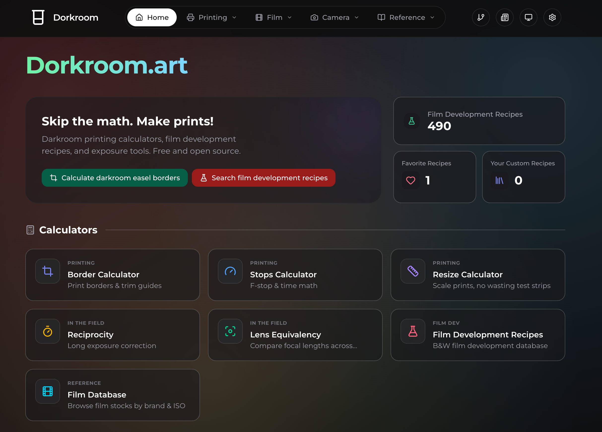

# Dorkroom.art

**Skip the math. Make prints!**



[**Dorkroom.art**](https://dorkroom.art/) is a collection of specialized calculators and tools designed for analog photographers and darkroom enthusiasts. Built to keep complex exposure math, border calculations, and chemistry planning out of your way so you can focus on making beautiful prints.

 [](https://github.com/narrowstacks/dorkroom/blob/main/LICENSE)

    

[](https://stats.uptimerobot.com/L75VVTPwtz) [](https://github.com/narrowstacks/dorkroom/actions/workflows/ci.yml) [](https://github.com/narrowstacks/dorkroom/pulls) [](https://github.com/narrowstacks/dorkroom/issues)

## What is Dorkroom?

Dorkroom provides useful calculators for darkroom printing, film development, and photography.

### Film Development Resources

- [**Development Recipes**](https://dorkroom.art/development) - Film + chemistry pairings and development times with many manufacturer approved development recipes.

### **Printing Tools**

- [**Border Calculator**](https://dorkroom.art/border) - Calculate precise print borders with trim-safe guides
- [**Resize Calculator**](https://dorkroom.art/resize) - Scale prints without endless test strips
- [**Stops Calculator**](https://dorkroom.art/resize) - Translate exposure stops into seconds

### **Shooting Tools**

- [**Reciprocity Calculator**](https://dorkroom.art/reciprocity) - Calculate exposure time correction for long exposure (reciprocity) failure on films

## In the Works

- **Development Recipes: _Volume Mixer_** - Accurate chemical mixing measurements based on a developer's dilutions.
- **Dorkroom Docs** - Thorough documentation on how to use all the tools Dorkroom provides.
- **Infobase** - A wiki-like docs database with plentiful guides on film, development, darkroom printing, and photography in general.
- **Camera Exposure Calculator** - For calculating equivalent camera exposure values.
- **Kindle browser support** - Support for for the app on the strange Kindle browser.
  - _**Help needed!** The site currently does not render on Kindle browsers_ ☹️

## Development Quick Start

### Prerequisites

- **Node.js** 18+ (required)
- **Bun** (required - project uses Bun workspaces)

Install Bun:

```bash
# macOS/Linux
curl -fsSL https://bun.sh/install | bash
```

```powershell
# Windows (via PowerShell)
powershell -c "irm bun.sh/install.ps1|iex"
```

### Development

```bash
# Clone the repository
git clone https://github.com/narrowstacks/dorkroom.git
cd dorkroom

# Install dependencies (requires Bun)
bun install

# Set up environment variables (for API testing)
cp .env.example .env
# Edit .env with your Supabase credentials

# Build before starting dev server
bunx nx build dorkroom

# Start development server
bunx nx dev dorkroom -- --host=0.0.0.0

# Open http://localhost:4200
```

### Building

```bash
# Build for production
bunx nx build dorkroom

# Ensure all packages are built
bunx nx run-many --target=build

# Visualize project dependencies
bunx nx graph
```

### Testing

```bash
# Run linting, testing, building, and typechecking in one go
bunx nx run-many -t lint test build typecheck

# Run test for only one package (logic, ui, api)
bunx nx test logic

```

## Technology Stack

- **Frontend**: React 19 with TypeScript 5.8.2
- **Styling**: Tailwind CSS 4.1.13 with custom darkroom theme
- **Build Tool**: Vite 6 with Nx 22 workspace
- **Testing**: Vitest 3 with Testing Library
- **Linting & Formatting**: Biome (single quotes, semicolons, trailing commas)
- **State Management**: TanStack Query v5 for server state
- **Routing**: TanStack Router v1 with file-based routing
- **Forms**: TanStack Form v1 with Zod validation
- **Tables**: TanStack Table v8 for data tables
- **Schema Validation**: Zod 4.1.12
- **Monorepo**: Nx with shared packages

## Architecture

Dorkroom is built as an Nx monorepo with clear separation of concerns:

```
apps/
  dorkroom/           # Main React application with TanStack Router file-based routing
    src/routes/       # File-based route definitions
packages/
  ui/                 # Shared UI components (@dorkroom/ui)
  logic/              # Business logic, hooks, queries (@dorkroom/logic)
  api/                # API utilities and TypeScript client (@dorkroom/api)
api/                  # Serverless API endpoints (Vercel functions)
```

### Key Architectural Patterns

- **File-Based Routing**: TanStack Router with automatic route tree generation
- **Type-Safe State**: TanStack Query for server state with query key structure
- **Form Validation**: TanStack Form with Zod schemas for runtime validation
- **Data Tables**: TanStack Table for sorting, filtering, and pagination

## Features

- **Responsive Design** - Works on desktop, tablet, and mobile
- **Multiple Themes** - Standard dark and light themes, as well as with black and white high contrast (ideal for e-ink) and black and red darkroom theme
  - Darkroom theme: User beware! This will still likely fog paper if your screen is left near it long enough, especially with non-OLED screens. A warning about this will be added to the app soon.
- **Fast Calculations** - Instant results with real-time validation
- **Type-Safe** - Full TypeScript coverage with strict mode
- **Offline-Ready** - Smart caching with TanStack Query
- **File-Based Routing** - Type-safe navigation with TanStack Router
- **Form Validation** - Runtime schema validation with Zod
- **Development Database** - Tons of film development recipes
- **Open Source** - Community-driven development under AGPL-3.0

## API

Dorkroom provides a comprehensive API for accessing film development data, available both as a TypeScript client package and as REST endpoints for external integrations.

**For detailed API documentation, see [API.md](docs/API.md)**

### Quick Overview

- **TypeScript Client**: `@dorkroom/api` package with fuzzy search and caching
- **REST Endpoints**: `/api/films`, `/api/developers`, `/api/combinations`
- **Features**: Query parameters, fuzzy search, request validation, CORS support
- **Authentication**: Supabase service role key (server-side only)

## Contributing

We welcome contributions from the analog photography community!

- **GitHub**: [https://github.com/narrowstacks/dorkroom](https://github.com/narrowstacks/dorkroom)
- **Issues**: Report bugs or request features
- **Pull Requests**: Submit improvements and new calculators

### Development Workflow

1. Fork the repository
2. Create a feature branch: `git checkout -b feature/new-calculator`
3. Make your changes following our code organization guidelines:
   - **Routes**: Add new routes to `apps/dorkroom/src/routes/` using file-based routing
   - **Business Logic**: Add calculations, utilities, types, and hooks to `packages/logic/`
   - **UI Components**: Add reusable components and contexts to `packages/ui/`
   - **API Client**: Add API utilities to `packages/api/`
   - **Validation Schemas**: Define Zod schemas in appropriate package
4. Test your changes thoroughly:
   ```bash
   # Test specific packages
   bunx nx test logic
   bunx nx test ui
   bunx nx test dorkroom
   ```
5. Run quality checks on affected packages:

   ```bash
   # Lint specific packages (Biome)
   bunx nx lint logic
   bunx nx lint ui
   bunx nx lint dorkroom

   # Type check specific packages
   bunx nx typecheck logic
   bunx nx typecheck ui
   bunx nx typecheck dorkroom

   # Format code with Biome
   bun run format
   ```

6. Submit a pull request

## Code Quality

This project maintains high code quality standards with package-specific tooling and modern development practices.

### Package Organization

- **`packages/logic/`** - Pure TypeScript business logic (calculations, utilities, types, hooks, TanStack Query queries)
- **`packages/ui/`** - Reusable React components, contexts, and form components
- **`packages/api/`** - API utilities, TypeScript client, and data fetching functions
- **`apps/dorkroom/`** - Main application with file-based routes and app-specific components

### Key Development Patterns

**TanStack Ecosystem:**

- All data fetching uses TanStack Query v5 with proper query key structure
- File-based routing with TanStack Router v1 for type-safe navigation
- Form handling with TanStack Form v1 and Zod schema validation
- Data tables with TanStack Table v8 for sorting, filtering, pagination

**Type Safety:**

- Strict TypeScript mode enabled
- Zod schemas for runtime validation
- Type-safe route parameters and search params
- No `any` types (use `unknown` when type cannot be determined)

### Quality Tools by Package

```bash
# Run quality checks on specific packages
bunx nx test logic        # Test business logic
bunx nx test ui          # Test UI components
bunx nx test dorkroom    # Test main application

bunx nx lint logic       # Lint business logic (Biome)
bunx nx lint ui         # Lint UI components (Biome)
bunx nx lint dorkroom   # Lint main application (Biome)

bunx nx typecheck logic     # Type check business logic
bunx nx typecheck ui       # Type check UI components
bunx nx typecheck dorkroom # Type check main application

# Run across all projects
bunx nx run-many --targets=lint,typecheck,test,build

# Format code with Biome (single quotes, semicolons, trailing commas)
bun run format

# Lint and auto-fix issues with Biome
bun run lint:fix
```

## Project Commands

| Command                                  | Description                    |
| ---------------------------------------- | ------------------------------ |
| `bunx nx dev dorkroom -- --host=0.0.0.0` | Start development server       |
| `bunx nx build dorkroom`                 | Build production bundle        |
| `bunx nx test`                           | Run tests                      |
| `bunx nx test --ui`                      | Run tests with UI              |
| `bunx nx lint dorkroom`                  | Run Biome linting              |
| `bunx nx typecheck dorkroom`             | TypeScript checking            |
| `bun run format`                         | Format code with Biome         |
| `bun run lint:fix`                       | Lint and auto-fix with Biome   |
| `bunx nx graph`                          | Visualize project dependencies |

## License

AGPL 3.0 License - see the [LICENSE](LICENSE) file for details.

You are allowed to reproduce any film development data on Dorkroom.art in any form or post on the Internet or any other computer network.

## Support

If you find Dorkroom useful for your darkroom work:

- ⭐ Star the project on GitHub
- 🐛 Report bugs and suggest features
- 🔗 Share with fellow analog photographers
- $ Support the developers on [Ko-fi](https://ko-fi.com/affords) or [sponsor us on GitHub](https://github.com/sponsors/narrowstacks)

## Special Thanks

- **[Harvey Milk Photo Center](https://harveymilkphotocenter.org) and its members**, for being a great community, resource, and my source of inspiration and my gainful employment.
- **[FilmDev.org](https://filmdev.org/)**, for providing a great database, and a great API allowing our users to import from said database.
- **[DigitalTruth Massive Development Chart](https://www.digitaltruth.com/devchart.php)**, for being a long time provider of film development time data, and whose interface frustrated me enough to make a whole alternative 😚.
  - And a really special thanks for disallowing republishing of your data _"in any form or post on the Internet or any other computer network."_, despite most of the data not being made by you! A real good motivator for adding the "official" development time tags to the development recipe page and sourcing directly from manufacturers.
